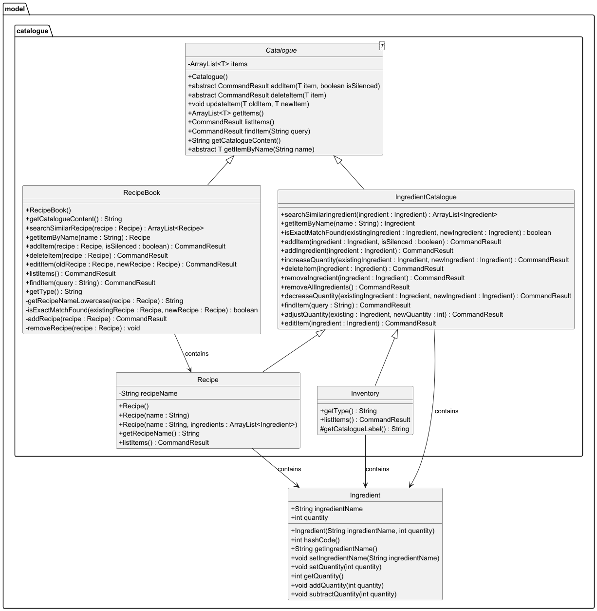
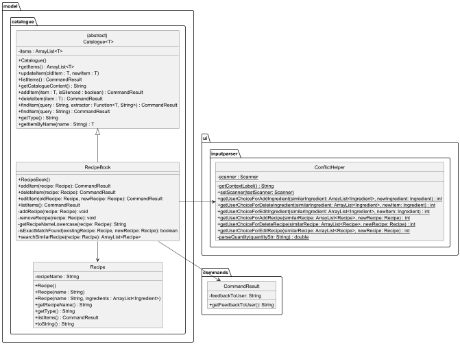

# Developer Guide

## Acknowledgements

KitchenCTRL uses the following tools for development:
1. [JUnit 5](https://junit.org/junit5/) - Used for testing
2. [Gradle](https://gradle.org/) - Used for build automation

## Design & implementation

The design and implementation of KitchenCTRL has been broken down into various sections
- [Architecture](#architecture)
- [UI Component](#ui-component)
- [Commands Component](#commands-component)
- [Model Component](#model-component)
- [Storage Component](#storage-component)

### Architecture
A high-level overview of the system is shown in the Architecture Diagram below.

This architecture consists of:
1. `Ui`, `Main`, `Parser`, `InputParser` and `Command` classes: 
    These classes manage user interaction, parsing input commands, and executing actions.
2. `Ingredient`, `Inventory`, `Recipe` and `RecipeBook` classes: 
    Model objects and collections used to manage the application data.
3. `Storage` class: Stores data between sessions.
4. `Exceptions`: Handle error cases 

### UI Component


The **UI Component** of KitchenCTRL is responsible for handling all input/output interactions with the user. 
It manages displaying messages, prompts, and results, as well as reading user input. 
The UI component ensures smooth communication between the user and the application.

#### Overview

The `Ui.java` class is the core component of the UI, responsible for:
- Displaying the ASCII logo upon program startup.
- Showing screen prompts for various states (e.g., WELCOME, INVENTORY, RECIPEBOOK, RECIPE).
- Displaying results of command executions.
- Reading user commands from the console.

This class provides methods for showing messages, reading user inputs, and displaying results after command execution. 
The `showScreenPrompt` method is a key method that displays the relevant help messages for each screen (e.g., inventory, recipe).

#### Key Methods

| Method                      | Description                                                                |
|-----------------------------|----------------------------------------------------------------------------|
| `showInitMessage`           | Displays the ASCII logo upon startup.                                      |
| `showDivider`               | Displays a divider line for separating sections in the UI.                 |
| `showScreenPrompt`          | Displays the appropriate screen prompt based on the current screen state.  |
| `showWelcomeMessage`        | Displays the welcome message and commands available on the main screen.    |
| `showInventoryMessage`      | Displays available commands for managing the inventory.                    |
| `showRecipeMessage`         | Displays available commands for managing recipes.                          |
| `showRecipeBookMessage`     | Displays available commands for managing the recipe book.                  |
| `showGoodbyeMessage`        | Displays a goodbye message when exiting the application.                   |
| `getUserCommand`            | Reads and returns the user's command input.                                |
| `showResultToUser`          | Displays the result of executing a command.                                |

#### Design Considerations

The `Ui.java` class serves as the intermediary between the user and the system’s internal logic. 
It maintains flexibility in terms of how input/output is handled, making it easier to change the interface 
or port it to a different platform if necessary.

Since the application is command-line-based, `Ui.java` directly interacts with the user through the standard console 
I/O operations. All I/O logic is contained within the UI class, ensuring that the rest of the system is decoupled 
from the user interface.

Additionally, the class uses a `Scanner` to read user input. If no input is provided, the program exits gracefully to 
avoid any exceptions. This prevents the system from crashing due to unexpected user actions.

#### Usage in the Application

The `Ui.java` class is crucial in driving the interaction between the user and the system. 
It integrates closely with other components such as:
- **Logic Component**: The UI displays feedback messages based on the results of executed commands that are 
  handled by the Logic component.
- **ScreenState**: The UI uses the `ScreenState` enum to determine which screen’s prompt should be displayed 
  (e.g., WELCOME, INVENTORY, RECIPE, RECIPEBOOK).

It allows the user to interact with the system in an intuitive way, providing clear instructions and feedback at every step.


### Commands Component


The commands package is responsible for encapsulating user actions and system operations as individual command classes. Each command represents a specific operation that the application can perform, such as modifying data, navigating between screens, or executing specific tasks.

All commands in this package inherit from a common parent class, typically named Command. This design ensures consistency and reusability across the application by enforcing a standard structure for all commands.

Key Features of the commands Package
Encapsulation: Each command encapsulates a single operation or behavior.
Extensibility: New commands can be added easily by extending the Command class.
Reusability: Commands are decoupled from the UI, making them reusable across different parts of the application.
Standardized Execution: All commands implement the execute() method, which defines the specific logic for the command.
Example: CookRecipeCommand
The CookRecipeCommand class is an example of a command that inherits from the Command class. It represents the action of "cooking" a recipe, which might involve deducting ingredients from inventory or updating the application state.

Explanation of CookRecipeCommand
Constructor: Accepts the name of the recipe to be cooked as a parameter.
execute() Method:
Calls the RecipeManager.cookRecipe() method to perform the cooking operation.
Returns a CommandResult with a success or failure message, depending on the outcome.
Summary
The commands package provides a structured way to define and execute operations in the application. By inheriting from the Command class, each command ensures consistency and adheres to the application's design principles. The CookRecipeCommand is a concrete example of how commands are implemented to perform specific tasks.

### Model Component

The **Model** component stores the application's core data and implements the logic for handling recipes and ingredients.

It contains the following key elements:
- A generic `Catalogue<T>` class that acts as a base for all data collections.
- `Inventory`, a catalogue of `Ingredient` objects.
- `Recipe`, a named list of `Ingredient` objects.
- `RecipeBook`, a catalogue of `Recipe` objects.
- `Ingredient`, a simple model representing a name–quantity pair.

The model exposes read-only views of stored data to other components and encapsulates logic for CRUD operations and intelligent user prompts (e.g., handling similar items). It relies on user input parsers (`InputParser`) to resolve ambiguities in add/delete scenarios.

It does not depend on any of the other three components (Logic, UI, or Storage), ensuring clear domain separation.

> ℹ️ **Note:** Recipes and inventory entries are internally handled using dynamic lists within `Catalogue<T>`, avoiding tight coupling and enabling code reuse across domain types.


#### RecipeBook Design
The `RecipeBook` class inherits from `Catalogue<Recipe>` and manages a list of `Recipe` objects. It provides CRUD functionality and uses `CommandResult` to return operation outcomes.



---

### Storage Component

#### CatalogueContentManager Design

##### Purpose

The `CatalogueContentManager` is a **utility class** responsible for handling file I/O for persistent storage of kitchen catalogues, including:

- Inventory
- RecipeBook

It ensures catalogue data is loaded from and saved to local text files.

##### Responsibilities

| Method                          | Description                                                            |
|---------------------------------|------------------------------------------------------------------------|
| `loadInventory()`               | Loads inventory data from `inventory.txt` into an `Inventory` object.  |
| `loadRecipeBook()`              | Loads structured recipes from `recipe_book.txt` into a `RecipeBook`.   |
| `loadConsumablesCatalogue(...)` | Generic loader for inventory-type catalogues using a `Supplier`.       |
| `loadRawCatalogueContent(...)`  | Loads raw file lines into a list. Handles basic file existence checks. |
| `saveToFile(Catalogue)`         | Persists a given catalogue’s content back to its associated file.      |
| `checkDirectoryExistence()`     | Ensures the `data/` directory exists before read/write operations.     |
| `checkFileExistence(...)`       | Creates the necessary file if it doesn’t exist.                        |

---

##### File Format

- **Inventory Format**:
  ```
  Tomato (6)
  Onion (4)
  ```

Each item in the inventory is represented as `name (quantity)`

- **Recipe Format**:
  ```
  Tomato Soup
  Tomato (2)
  Onion (1)

  Grilled Cheese
  Bread (3)
  Cheese (5)
  ```

Each recipe ends with a **blank line**.


##### Integration

- Automatically called in `KitchenCTRL.initializeCatalogues()`.
- Automatically saves data when user exits via `ByeCommand`.

```
CatalogueContentManager contentManager = new CatalogueContentManager();
Inventory inventory = contentManager.loadInventory();
RecipeBook recipeBook = contentManager.loadRecipeBook();

contentManager.saveToFile(inventory);
```


---

## Product scope

### Target user profile

* Individuals who prefer lightweight, distraction-free tools over cluttered mobile apps
* Users comfortable typing commands in a terminal (basic command-line experience)
* People who want a quick and efficient way to track ingredients and manage recipes.

### Value proposition

KitchenCTRL solves the everyday hassle of keeping track of kitchen ingredients and meal planning.
It provides a unified, command-line interface to:

1. Track pantry inventory and prevent overbuying or waste
2. Store and manage recipes easily

Unlike traditional mobile or web apps, KitchenCTRL is fast, lightweight, and designed for keyboard-driven users who want 
maximum functionality without the clutter.

## User Stories

| Version | As a ...  | I want to ...                                                                   | So that I can ...                                                |
|---------|-----------|---------------------------------------------------------------------------------|------------------------------------------------------------------|
| v1.0    | home cook | manage individual ingredients                                                   | easily track their quantities and usage in recipes and inventory |
| v1.0    | home cook | want to associate ingredients with recipes and inventory items                  | track what ingredients I have and what I need for my recipe      |
| v1.0    | home cook | manage my inventory by adding, deleting, and viewing items                      | organize my cooking efficiently                                  |
| v1.0    | user      | enter commands into the system                                                  | interact with it and perform necessary actions efficiently       |
| v1.0    | user      | save and retrieve data                                                          | have accessible and up-to-date information                       |
| v2.0    | home cook | manage my recipes by adding, deleting, modifying and viewing ingredients needed | organize my recipes efficiently                                  |
| v2.0    | home cook | manage my book of recipes by adding, deleting, modifying and viewing my recipes | organize my book of recipes efficiently                          |

## Non-Functional Requirements

GiT is able to handle large amounts of data, stored in /data/inventory.txt and /data/recipe_book.txt.
GiT should be easy for a new user to grasp, and allow experienced users to use different functionalities quickly.

## Glossary

Java - Object-oriented programming language used to create KitchenCTRL.
Command Line Interface - Text-based user interface to allow users to interact with KitchenCTRL.


## Instructions for manual testing

First, testers can install KitchenCTRL by following these instructions:

Ensure that you have Java 17 or above installed.
Down the latest version of KitchenCTRL from [here](https://github.com/AY2425S2-CS2113-T13-1/tp/releases).
Open a command terminal, cd into the folder where the JAR file is and use java -jar tp.jar to run KitchenCTRL.
